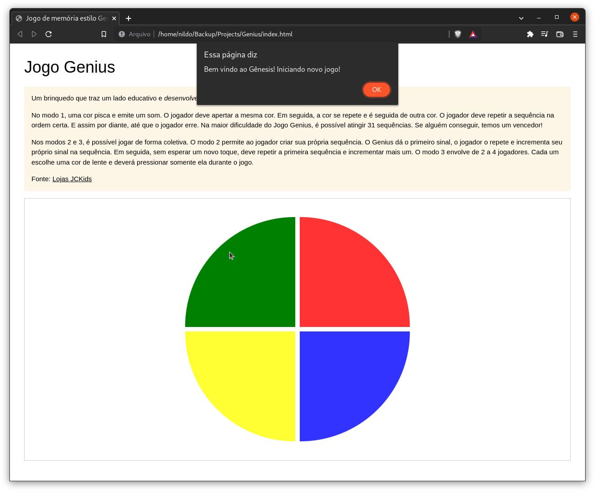

# Genius
## Jogo estilo Genius

Um brinquedo que traz um lado educativo e desenvolve a memória e os reflexos da 
criança:

No modo 1, uma cor pisca e emite um som. O jogador deve apertar a mesma cor. Em 
seguida, a cor se repete e é seguida de outra cor. O jogador deve repetir a 
sequência na ordem certa. E assim por diante, até que o jogador erre. Na maior 
dificuldade do Jogo Genius, é possível atingir 31 sequências. Se alguém 
conseguir, temos um vencedor!

Nos modos 2 e 3, é possível jogar de forma coletiva. O modo 2 permite ao jogador 
criar sua própria sequência. O Genius dá o primeiro sinal, o jogador o repete e 
incrementa seu próprio sinal na sequência. Em seguida, sem esperar um novo toque, 
deve repetir a primeira sequência e incrementar mais um. O modo 3 envolve de 2 a 
4 jogadores. Cada um escolhe uma cor de lente e deverá pressionar somente ela 
durante o jogo.

Fonte [Lojas JCKids](https://blog.lojasjckids.com.br/jogo-genius/)

Este é um projeto desenvolvido em parceria com a **Dio**, com a mentoria da 
*Gabriela Pinheiro* e que faz parte do BootCamp **JavaScript Game Developer**.

